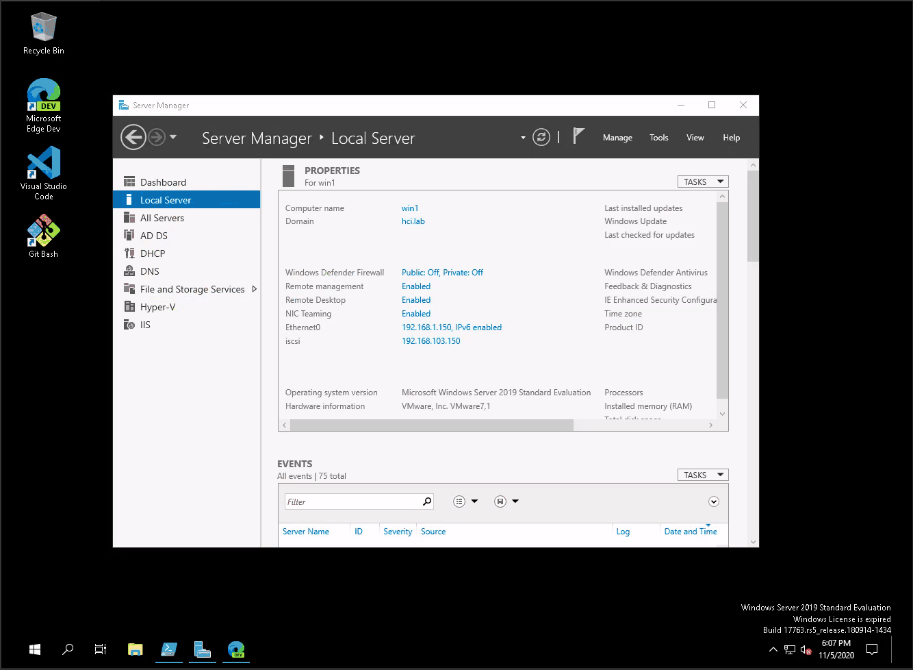

# solidfire-windows: Notes on Microsoft Windows with NetApp SolidFire

Notes on Windows Server Hyper-V clusters with NetApp SolidFire, including (but not limited to) NetApp HCI H410C (servers) and Mellanox SN2010 switches.

For additional SolidFire-related information, please refer to [awesome-solidfire](https://github.com/scaleoutsean/awesome-solidfire).

- [solidfire-windows: Notes on Microsoft Windows with NetApp SolidFire](#solidfire-windows-notes-on-microsoft-windows-with-netapp-solidfire)
  - [General Notes](#general-notes)
    - [Windows Server 2016, 2019, 2022, 2025](#windows-server-2016-2019-2022-2025)
  - [Host and Guest Configuration Notes](#host-and-guest-configuration-notes)
    - [Networking](#networking)
    - [iSCSI](#iscsi)
    - [Multipath I/O](#multipath-io)
    - [Disks](#disks)
    - [Hyper-V](#hyper-v)
    - [Automation](#automation)
    - [Direct VM Access to iSCSI targets](#direct-vm-access-to-iscsi-targets)
    - [Monitoring, Backup and other Integrations](#monitoring-backup-and-other-integrations)
  - [Application Notes](#application-notes)
  - [Generic workflow for Hyper-V Clusters with NetApp SolidFire](#generic-workflow-for-hyper-v-clusters-with-netapp-solidfire)
  - [Hyper-V and Storage Administration](#hyper-v-and-storage-administration)
    - [Security](#security)
    - [Windows Admin Center](#windows-admin-center)
    - [Create and Remove Volumes](#create-and-remove-volumes)
    - [Storage Snapshots](#storage-snapshots)
    - [Storage Clones](#storage-clones)
    - [Volume Resize](#volume-resize)
    - [Rethin (Unmap) Unused Filesystem Blocks](#rethin-unmap-unused-filesystem-blocks)
    - [Dealing with Unused Volumes](#dealing-with-unused-volumes)
    - [Storage-Based and Native Hyper-V Replication](#storage-based-and-native-hyper-v-replication)
    - [Switch (Failover) to SolidFire Cluster with Replica Volumes](#switch-failover-to-solidfire-cluster-with-replica-volumes)
    - [Using SolidFire Object Attributes](#using-solidfire-object-attributes)
  - [Microsoft Windows drivers for NetApp HCI Servers ("Compute Nodes")](#microsoft-windows-drivers-for-netapp-hci-servers-compute-nodes)
  - [Microsoft Windows on NetApp HCI Compute Nodes with RAID1 system volume](#microsoft-windows-on-netapp-hci-compute-nodes-with-raid1-system-volume)
  - [NetApp Active IQ OneCollect](#netapp-active-iq-onecollect)
    - [NetApp H410C](#netapp-h410c)
      - [Network Adapters and Ports](#network-adapters-and-ports)
    - [NetApp H615C and H610C](#netapp-h615c-and-h610c)
  - [Demo Videos](#demo-videos)
  - [Scripts for NetApp HCI and SolidFire storage for Microsoft Windows](#scripts-for-netapp-hci-and-solidfire-storage-for-microsoft-windows)
    - [Start Windows iSCSI Initiator and Create storage account(s), Volumes, VAG and register IQN(s) on SolidFire](#start-windows-iscsi-initiator-and-create-storage-accounts-volumes-vag-and-register-iqns-on-solidfire)
    - [Map SolidFire to Windows volumes](#map-solidfire-to-windows-volumes)
    - [Automate host-side volume operations](#automate-host-side-volume-operations)
  - [Monitoring](#monitoring)
  - [Frequently Asked Questions](#frequently-asked-questions)
  - [License and Trademarks](#license-and-trademarks)

## General Notes

- Each SolidFire volume is available on one network (subnet and VLAN). Different targets may be served over multiple networks and VLANs when SolidFire uses Trunk Mode switch ports.
  - iSCSI clients connect to SolidFire portal - Storage Virtual IP (SVIP) - which redirects each to the SolidFire node which hosts the target (volume) of interest (iSCSI login redirection is described in [RFC-3720](https://tools.ietf.org/html/rfc3720))
  - Volumes are occasionally rebalanced, transparently to the client
- Multiple connections from one iSCSI client to single volume (with or without MPIO) are rarely needed (NetApp AFF and E-Series are more suitable for one or few large workloads)
  - Network adapter teaming (bonding) creates one path per volume and provides link redundancy, which is enough for 90% of use cases
  - It is not possible to establish two connections (sessions) to the same volume with only one initiator IP
  - There are several ways to create two iSCSI connections to a SolidFire volume. They require Multipath I/O and one of the following (not a complete list):
    - Use four NICs to create two teams on the same network, set up one connection from each adapter team's IP address
    - Use two non-teamed NICs on the same network, set up one connection from each interface's IP address
    - Use one teamed interface with two vEthernet NICs for ManagementOS, set up one connection from each vEthernet interface's IP address
    - Use Windows Network Controller (available only in Windows Server [Datacenter Edition](https://docs.microsoft.com/en-us/windows-server/get-started-19/editions-comparison-19))

### Windows Server 2016, 2019, 2022, 2025

- Windows Server 2016 and 2019 are officially supported.
- Windows Server 2022 Preview Build 20303 with Hyper-V has been touch-tested with SolidFire 12.2. In terms of making use of SolidFire iSCSI targets, it does not seem different compared to Windows Server 2019. Containers/Kubernetes have not been tested.
- Windows Server 2025 Preview Build 26085.1 - has been touch [tested](https://scaleoutsean.github.io/2024/03/31/windows-server-2025-with-solidfire-part-one.html) with SolidFire 12.5. Nothing odd has been observed iSCSI storage-wise.

## Host and Guest Configuration Notes

### Networking

- Use Jumbo Frames on networks used for iSCSI, Live Migration and/or backup
- Use enterprise-grade network switches such as Mellanox SN2010 (which you can purchase from NetApp)
- Consider disabling
  - IPv6 on interfaces on iSCSI network(s), if you don't have other, IPv6 capable iSCSI targets in your environment
  - NIC registration in DNS for interfaces on iSCSI network (also Live Migration and other networks which don't need it)
  - DHCP service on iSCSI and Live Migration network(s), but if you need it, hand out MTU 9000 or such through DHCP options
  - DNS and NETBIOS registration on iSCSI and Live Migration network(s)
- It may be more convenient to combine 2 or 4 Mellanox NICs into 1 or 2 LACP Teams, and use Trunk Mode on network switch ports and VLANs on VMSwitch (to segregate workloads and tenants)
- Some network and other configuration changes may require Windows to be restarted although it won't prompt you, so if some configuration changes don't take effect, either check the documentation or reboot the server to see if that helps
- It appears light and moderate workloads don't require any tuning on iSCSI client (even Jumbo Frames, although that is recommended and a semi-hard requirement on the SolidFire/NetApp HCI side)
- It is practically mandatory to use Trunk Mode on 10/25 GigE because in all likelihood you'll need more than one VLAN for iSCSI, backup and other purposes. Mellanox ONYX (SN2010, SN2100, SN2700) has a variant of it called Hybrid Mode
- In non-Hyper-V (i.e. non-virtualized) Windows environments, two or more network cables can be Teamed in Trunk Mode (see this [Mellanox article](https://community.mellanox.com/s/article/howto-configure-multiple-vlans-on-windows-2012-server)) to provide VLAN-based segregation between iSCSI, workload and other traffic

### iSCSI

- (Optional) Increase the maximum duration of I/O timeouts and lower the frequency of accessibility checks (not sure how much it matters - likely not unless the cluster is very busy or has hundreds of volumes)
- VMs and services that directly attach to iSCSI disks sometimes need to be set to Delayed Start to give iSCSI Initiator enough time to access SolidFire volumes. My experiments with creating service dependencies (on iSCSI Initiator) didn't work out, but delayed start (say, of SQL Server service) did

### Multipath I/O

- If you don't have multiple links to SolidFire or other iSCSI target, you don't need it (one less thing to install and configure)
- When adding vendor and product ID to MPIO configuration, use `SolidFir` and `SSD SAN`, respectively (only recommended if you use Multipath-IO (`Get-MPIOAvailableHW -VendorId "SolidFir"`))
- There are no recent comparisons of various Multipath load balancing options on SolidFire. LQD (`Set-MSDSMGlobalDefaultLoadBalancePolicy -Policy LQD`)) supposedly gives best results in terms of performance, but if you're curious you can spend 30 minutes to evaluate them in your environment with your workload(s)

### Disks

- Maximum SolidFire volume size is 16 TiB; it's hard to generalize but for an N-node SolidFire cluster one could create anywhere between N x 2 to N x 4 volumes, 1-4 TB each (example: five node cluster, 10 to 20 volumes, 2-4 TB each)
- SolidFire supports 512e (and as of v12.2 still defaults to 512e) but newer Hyper-V environments and Hyper-V VMs should work fine with 4kB volumes, so you may want to remember to disable 512e when creating new volumes if that works for you
- Maximum SolidFire volume performance depends on the I/O request sizes and read-write ratio but it tends to be somewhere between traditional flash storage and virtualized distributed flash storage
- In the case of very large volumes or very busy workloads (e.g. sustained 30,000 IOPS or 300 MB/s) striped Dynamic Volumes may be used to spread I/O over several volumes, although they have some limitations (in terms of manageability on Windows, for example backup and restore). Don't unnecessarily complicate things
- Another way to spread the workload is to spread single VM's disks over several different (Cluster Shared or other) SolidFire volumes. This helps if the workload isn't concentrated on one hot file (in which case striped Dynamic Volumes can be used)
- The (Default) 4kB NTFS block size ought to work best in terms of efficiency, but there is no anecdotal evidence so this should be confirmed in practice through testing. There are various practices for SQL Server (based on type of SQL data (DB, log, etc.) and use case (OLTP, OLAP, etc) so you can split such workloads across disks with different properties)
- Microsoft does not support Windows Storage Spaces with iSCSI storage. They can be configured with SolidFire and work similarly to striped Dynamic Volumes, although with Storage Spaces strips are wider and you're essentially on your own as far as Support is concerned

### Hyper-V

- Note that Virtual Switches configured through Hyper-V Manager have default values not immediately obvious to the user
- Once you create Virtual Switches, re-check IPv6 addresses (best eliminate them), adapter binding order and packet sizes on vEthernet NICs (including ManagementOS)
- Re-check Hyper-V Live Migration settings - make sure iSCSI and Management networks have lowest preference for Live Migration
- You may want to make sure that SMB3 works if you set Hyper-V to use it for Live Migration (refer to various Windows documentation)
- If you have only [Gen 2](https://docs.microsoft.com/en-us/windows-server/virtualization/hyper-v/plan/should-i-create-a-generation-1-or-2-virtual-machine-in-hyper-v) VMs, you may create SolidFire volumes with 4kB rather than emulated 512b sectors (`-Enable512e:$False`). Potentially consolidate Gen 1 VMs on a handful of dedicated volumes with 512 byte emulation
  
### Automation

- Deploy SolidFire PowerShell Tools for Windows on your management VM. It is recommended to use SolidFire PowerShell Tools for Microsoft PowerShell 5.1: `Install-Module -Name SolidFire  -Scope CurrentUser`. If PowerShell 6 (or 7) is desired, consider using PowerShell Tools 1.6 (download from NetApp Support Site > Tools section as that version is not in PowerShell Gallery)
- Install SolidFire VSS Hardware Provider for Windows Server 2019 and 2016 on your Hyper-V hosts (and VMs, if you have them configured to directly access iSCSI)
  - SQL Server 2022 doesn't need VSS, it works with [generic hardware snapshots](https://scaleoutsean.github.io/2024/03/31/windows-server-2025-with-solidfire-part-one.html#sql-server-t-sql-snapshots-and-solidfire-volume-snapshots) and SolidFire supports consistency groups
- SolidFire is easy to automate (`New-SFVolume`, `Add-SFVolumeToVolumeAccessGroup`, after you've set up cluster, added iSCSI initiators and created QoS policies and Volume Access Groups; to remove a volume from Hyper-V CSVs you'd remove it from WFC and OS as per usual procedures for iSCSI devices, remove it from VAG (`Remove-SFVolumeFromVolumeAccessGroup`) and then delete it (`Remove-SFVolume`), assuming it didn't have replication or SnapMirror relationships in place
- It's possible to automate SolidFire with Terraform or Ansible, but unless one already uses (or wants to use) these tools it's easy enough to put together a custom PowerShell script that works for your needs

### Direct VM Access to iSCSI targets

- Like with VMware "RDM", you need to make sure the VMs may access iSCSI network(s), and they must use unique (to each VM or clustered group of VMs) initiators, VAGs, SolidFire (CHAP) accounts and volumes
- The NetApp Interoperability Matrix has information about supported SolidFire iSCSI clients (see [awesome-solidfire](https://github.com/scaleoutsean/awesome-solidfire))

### Monitoring, Backup and other Integrations

- Larger environments may consider attaching a NetApp E-Series (I recommend the 25G iSCSI HIC optional add-on) array to SolidFire environment. Backup application can be directly attached to E-Series via 25G or 10G iSCSI
- Hyper-V notes for Veeam 10
  - Veeam BR has I/O latency-based throttle settings so as to not overload Hyper-V host(s) during backup. They acts as workload and job throttles so check this out if you use Veeam
  - If Veeam runs from within a VM, VMSwitch settings can be used to reserve minimum and limit maximum bandwidth on Veeam network(s) used by backup server
  - If Veeam BR uses SolidFire storage, it may be a good idea to keep Veeam BR VM on its own CSV to eliminate the impact of write-heavy workload on other VMs. For non-Edge environments, attach Veeam VMs to external storage such as E-Series
  - Veeam BR PowerShell can import SolidFire (or SolidFire.Core, for PowerShell is v6+) module for automation and customization of backup and restore jobs
- See [awesome-solidfire](https://github.com/scaleoutsean/awesome-solidfire) for general information about various SolidFire integrations

## Application Notes

- NetApp has published several TR's (Technical Reports) for Windows-based workloads. If you search the Web you may find more or less recent TR's that may help you
- There are various best practices for SQL Server, but that is a topic in itself and there's a NetApp TR that deals with it. You may split DB workloads across VM disks and SolidFire disks with same or different (e.g for data & logs) QoS properties
- High Availability: consider storing VM OS disks on CSVs but store data on directly accessed SolidFire iSCSI volumes (which requires slightly more account management on SolidFire as you'd have one account or one Volume Access Group per such HA application, so you may put "light" HA apps on CSVs and rely on VM failover, to find a good balance between manageability, availability and performance)

## Generic workflow for Hyper-V Clusters with NetApp SolidFire

- Analyze all requirements (availability, security, performance, networking...)
  - If you want to use SMB or NFS to connect to NetApp AFF/FAS, or iSCSI to connect AFF/FAS/E-Series or other storage, consider those requirements as well. NetApp E-Series iSCSI targets, for example, have different requirements and multipathing works differently from SolidFire and such cases it may be better to use separate networks for that traffic (or vEthernet's on separate VLANs)
- Formulate a deployment plan
- Configure network switches
  - If you use NetApp HCI compute nodes, it's probably best to get NetApp H-Series SN2010 (Mellanox) L2 switches
- Deploy Windows hosts
  - Install base OS (Windows Server 2019 Datacenter Edition, for example)
  - Install drivers, plugins, modules, etc.
    - Solidfire VSS Hardware Provider v2 (only on Hyper-V hosts). Note that SQL Server 2022 can [use T-SQL](https://scaleoutsean.github.io/2024/03/31/windows-server-2025-with-solidfire-part-one.html#sql-server-t-sql-snapshots-and-solidfire-volume-snapshots) with hardware snapshots
    - SolidFire PowerShell Tools 1.5.1 or newer for Microsoft PowerShell 5.1 (management clients only). Use SolidFire Core with PowerShell 7.
    - Drivers (NetApp HCI H41C node needs one for Mellanox and two for Intel - see Drivers section)
  - Install required Windows features (Multipath I/O, Failover-Cluster, etc.) on Hyper-V hosts
  - Update OS and reboot (you may need to do that more than once)
- Configure Windows hosts
  - Hostnames, timezone, network interfaces, routes, DNS (A & PTR including virtual IPs), DHCP, IPv6, etc.
  - Join Active Directory (recommended) and create an alias (group) for cluster administrators
    - Enable NTP service on the Active Directory server (or other server) on the management network (used by SolidFire management IPs and the optional IPMI)
  - Make sure cluster members' DNS server is pointed at ADS DNS and that ADS forwards other requests upstream (DNS resolution must work!)
  - Configure Hyper-V and virtual switches
    - If Hyper-V is configured for Kerberos make sure Windows AD delegation for required resources is allowed with Kerberos
    - Recheck VMSwitch and vEthernet NIC settings (Jumbo Frames, IPv6, binding order and so on) because some options can be set only when VMSwitches are created and cannot be changed later
    - Recheck Live Migraiton network preference in Hyper-V
- Configure SolidFire storage
  - Create SolidFire cluster
  - Create DNS entries for SolidFire cluster (management interfaces, IPMI, out-of-band SolidFire management node ("mNode"))
  - SolidFire mMnode can be installed from an ISO that you can download from Downloads at NetApp.com. Installation guide: work by NetApp Hybrid Cloud Control [how-to](https://docs.netapp.com/us-en/hci/docs/task_mnode_install.html), just skip the vCenter part if you're installing in a Windows Hyper-V environment that doesn't have vCenter. NOTE: as of early 2021 mNode requires 24 GB RAM and on Hyper-V RAM should be fully provisioned otherwise you may not be able to boot the VM
  - Point Solidire and mNode NTP client to Windows ADS (primary and secondary) and if Internet is reachable from SolidFire management network, at least one public NTP server (public NTP servers may ocassionally time out which is harmless)
  - Create and upload valid TLS certificates to SolidFire cluster nodes (each node's management IP, cluster Management Virtual IP, hardware BMC IP, out-of-band mNode IP; preferrably use Active Directory Certification Authority and DNS FQDNs rather than DIY OpenSSL stuff)
    - Sometimes it's suitable to keep infrastture management hosts on a separate network and subdomain (`Add-DnsServerPrimaryZone -Name infra.netapp.io`)
  - Add Windows Hyper-V (and other, if necessary) hosts' initiators to Initiators list and create one or more Volume Access Groups (VAGs). Then add initiators to appropriate VAGs if you plan to use VAGs and not CHAP (if you join ADS after you've done this, Windows Initiator Names will change so you'd have to re-do all SolidFire host IQNs and VAGs)
  - Create one low performance QoS policy for Quorum volume (e.g. Min 100, Max 500, Burst 1,000) and several other policies for regular workloads (Bronze, Silver, Gold)
  - Create one quorum volume with the Quorum QoS storage policy and add it to the Hyper-V cluster VAG
  - Enable and start iSCSI initiator service on each Windows Hyper-V host
  - Configure iSCSI initiators and Multipath I/O - only one Portal (SolidFire Storage Virtual IP) needs to be added and Multipath I/O only if you have multiple paths to SVIP
  - Create one or several volumes for VMs (Cluster Shared Volumes) and add them to the same Hyper-V VAG
    - Some scripts to get you started are available in the SolidFire PowerShell Tools repo on Github
- Prepare Hyper-V for Windows Failover Clustering
  - Check firewall, DNS, AD configuration
  - Recheck adapter binding, IPv6, DNS, as it may look different after Virtual Switch and vEthernet adapter get added
  - Enable and start iSCSI Intiator service
  - Login iSCSI clients to Portal and connect to Quorum disk. On one Hyper-V host bring the disk online and create NTFS volume on it using default settings
- Create Windows Failover Cluster
  - Validate configuration, especially DNS and firewall configuration
  - [Optionally](https://social.technet.microsoft.com/Forums/en-US/bf5285bc-fc72-474f-a0f4-232a2bd230b1/smb-signing-breaks-csv-access-crossnode?forum=winserverClustering) disable SMB signing/encryption
  - Create Failover Cluster
    - If you use Failover Cluster to protect VMs, that becomes default location to create protected VMs (rather than Hyper-V Manager)
  - Add quorum disk to Failover Cluster
- Deploy Cluster Shared Volumes
  - On all Windows hosts, login to SolidFire volumes meant for data
  - On one Windows host, bring those volumes online and format them
  - In the Failover Cluster GUI (assuming you use it to provide HA to VMs), add new cluster disk(s) and convert them to Cluster Shared Volumes
  - When deploying VMs, place them on a CSV or change Hyper-V defaults to make that happen automatically
- [Optional] Install (out-of-band) SolidFire Management VM (use ISO to install) on Cluster Shared Storage. It can monitor SolidFire events and hardware and alert NetApp Support to problems, as well as give you actionable info via NetApp ActiveIQ analytics
- [Optional] Install and configure NetApp OneCollect for scheduled gathering of sytem events and configuration changes. It can be extremely helpful in case of technical issues with the cluster

## Hyper-V and Storage Administration

- Highly recommended: come up with naming rules (including for clones and remote copies, if aplicable) for SolidFire Windows and CSV Volumes and (SolidFire) Snapshots

### Security

- Deploy valid TLS certificates for SolidFire nodes and IPMI (if IPMI is in use)
- Management IPs (SolidFire nodes, cluster Management IP, mNode and IPMI) should be on dedicated management network
  - Consider which API and CLI clients need access to this network
  - Hyper-V hosts and VMs with direct access to iSCSI targets may need it for VSS-assisted snapshots, management workstations may need it for PowerShell automation, backup software that integrates with SolidFire may need it to invoke hardware snapshots, etc.
  - Outgoing access from SolidFire and IPMI nodes may be required for monitoring (mNode (ActiveIQ), SNMP v2 or v3)
- iSCSI network generally needs to be exposed to Hyper-V hosts and VMs that need direct access to iSCSI
  - These VMs and Hyper-V can use different VLANs (Trunk Mode to VM switch, and access mode to Management OS and some VMs, for example)
  - Another consumer of iSCSI may be backup proxies, if backup software uses dedicated backup proxy VMs

### Windows Admin Center

- Currently there is no Admin Center plugin for SolidFire, but as highlighted above, frequent storage-side operations are fairly rare
- Note that Admin Center can add Hyper-V clusters and individual servers; you may want to add a Hyper-V cluster (which adds the members as well)
- At this time, a Hyper-V storage management workflow in Windows Admin Center might look like this:
  - Prepare PowerShell scripts for operations you perform more frequently (e.g. Add, Remove, Resize, and Clone) and keep them on one or two Hyper-V hosts (or simply on Admin's network share)
  - When one of these operations need to be perofrmed, use Admin Center to start a browser-based remote PowerShell session from a Hyper-V host, and execute the PowerShell script(s)
  - Then navigate to other parts of Admin Center (view CSVs, create VMs, etc.)
- Note that Admin Center cannot be installed on Active Directory Domain Controller so maybe find a "management workstation" that can be used for that
- Hyper-V cluster capacity and performance can be monitored through Admin Center dashboards; if you'd like to monitor it from elsewhere, consider the gratis or commercial version of NetApp Cloud Insights

### Create and Remove Volumes

- `New-SFVolume` (pay special attention to volume naming, because in SolidFire you can have duplicate volume names; VolumeID's would be different, of course)
- Perform iSCSI target rescan, login to new target on all Hyper-V servers (you may want to use `-IsPersistent:$True`)
- On one host, bring the new disk online, intialize it and create a filesystem (NTFS seems like best choice for SolidFire environments and use cases)
- Add the disk to Hyper-V cluster
- Optionally, convert the cluster disk to CSV
- Optionally, rename new CSV
- The removal would work in reverse; remove or migrate the VMs prior to disk being reoved from Hyper-V, reset and ultimately deleted on SolidFire (it can be undeleted unless it gets manually purged or naturally expires (4 hours later))

### Storage Snapshots

- SolidFire VSS Hardware Provider is available if you need application-consistent snapshots (and the docs have CLI examples on how to script it)
- Crash consistent snapshots may be created from PowerShell (`New-SFSnapshot`) or the SolidFire UI
  - Group snapshots are available as well (`New-SFGroupSnapshot`)
  - Demo Videos section below has a video which shows how to create a snapshot schedule in the SolidFire Web UI
  - To create a bunch of schedules, create one in the Web UI, then `Get` it with SolidFire PowerShell tools and use it as a template to create others from PowerShell, or add other Volumes (by Volume ID) to the same snapshot schedule
- Other alternatives include backup software (CommVault, Veeam, etc.) which may also leverage SolidFire VSS Hardware Provider

### Storage Clones

- Clones have to be created from existing volumes or snapshots (asynchronous operation), few of which can run in parallel (`New-SFClone`, refer to Element API documentation for details)
- Like with most other block storage systems it is best to create a dedicated iSCSI client (a VM would do) that can remove read flag from a clone using dispart and resignature (assign a different Volume ID) the volume, and then use SolidFire API or GUI to re-assign the volume to a Hyper-V VAG (or other host (group))
- Note that it is possible to "resync" one volume to another, so if you need to update a large clone that differs by just a couple of GB, check out `Copy-SFVolume` - it can help you significantly speed up clone refresh operation
- As mentioned above, have clear naming rules to avoid confusion due to duplicate volume names

### Volume Resize

- You can extend a volume on SolidFire (up to 16 TiB) using `Set-SFVolume` or the UI, and then resize the volume and filesystem on the iSCSI client (I haven't tried with CSV)
- Volume shrink; if you want to shrink a volume create a new one, move the VMs to the new volume, and then remove the large volume; as data would be physically copied from one volume to another, mind the copy workload if large amounts of VMs are involved. If done offline, a good approach could be to unregister a VM, use NetApp XCP or xcopy (with appropriate bandwidth limit during busy hours) to move the VMs to new volume and then register the VMs without changing VM ID

### Rethin (Unmap) Unused Filesystem Blocks

- Newer Windows have TRIM/UNMAP enabled by default, and Hyper-V passes through any UNMAP requests from guests, as long as guests are enabled, nothing has to be done
- For older Windows VMs or on the management OS, SDelete may be used to periodically zero-out empty space. On Linux, use `fstrim`.
- If you create a schedule to periodically run SDelete or fstrim, try to randomize run times so that you don't kick it off for a bunch of VMs at the same time
- SolidFire reclaims unmapped capacity periodically so it may take an hour or so to notice effects of this operation
- See [this blog post](https://scaleoutsean.github.io/2023/12/12/solidfire-unmap-hyper-v.html) with notes related to UNMAP on Windows 11 and similarly old Windows Server products

### Dealing with Unused Volumes

- SolidFire lets you tag volumes (using a project code or owner name, for example)
- As time goes by, you may end up with a bunch of unused (that is, without iSCSI connections) volumes that seemingly belong to no one, so use proper naming and tag them to be able to sort them out and create meaningful reports
- It is also possible (15 lines of PowerShell) to identify unused volumes (sample PowerShell script that does this can be found in the Awesome SolidFire repo)

### Storage-Based and Native Hyper-V Replication

- Synchronous and Asynchronous SolidFire replication can be set up in seconds through PowerShell
  - A snapshot of a paired (replicated) volume can be tagged to follow established replication relationship
- Hyper-V supports native replication of VMs but I haven't tested it

### Switch (Failover) to SolidFire Cluster with Replica Volumes

- Each SolidFire volume contains at least two details unique to that cluster, the cluster string and volume ID, as well as some other stuff (see in your iSCSI Intitiator Control Panel)
- Example: volume sql3 from DC1 replicated to volume drsql3 in DC2
  - DC1: `iqn.2010-01.com.solidfire:ozv4.sql3.8` - Cluster ID `ozv4`, Volume `sql3`, Volume ID `8`
  - DC2: `iqn.2010-01.com.solidfire:dro1.drsql3.27` - Cluster ID `dro1`, Volume `drsql3`, Volume ID `27`
  - `iqn.2010-01.com.solidfire:` is fixed, the rest is `<ClusterUniqueID>.<VolumeName>.<VolumeID>`
- Search, replace, re-scan and connect accordingly

### Using SolidFire Object Attributes

- Key SolidFire storage objects - such as Volumes and Snapshots - can have custom attributes in the form of KV pairs. NetApp Trident makes use of custom volume attributes
- We can leverage this feature for management and reporting on Hyper-V as well (see Element API Reference Guide or awesome-solidfire repository for details on this)

## Microsoft Windows drivers for NetApp HCI Servers ("Compute Nodes")

- There are no "official" NetApp-released drivers and firmware for Microsoft Windows, so we can use recent vendor-released drivers and firmware (see driver notes below)
- INSTALLATION: General approach (example for Mellanox NIC(s) on the H410C and H615C)
  - Check the latest NetApp HCI drivers (login for support site required) [here](https://kb.netapp.com/Advice_and_Troubleshooting/Hybrid_Cloud_Infrastructure/NetApp_HCI/Firmware_and_driver_versions_in_NetApp_HCI_and_NetApp_Element_software) and with that find the latest f/w for your system and NIC. Pay attention - H615C and H410C may support different Mellanox 4-Lx firmware although both use the same chip
  - Now with this firmware version information go to NVIDIA/Mellanox driver downloads and start looking from newer drivers WinOF-2 drivers. Driver Release Notes contain the information about recommended and supported NIC f/w (an example for WinOF-2 v2.30.51000 can be seen [here](https://docs.mellanox.com/display/winof2v23051000/Supported+Network+Adapter+Cards+and+MFT+Tools))
  - Do the same for the Intel NIC (if applicable, such as on the H410C)
  - Update f/w first and then install a matching Windows NIC driver
    - If you install a Mellanox driver that's very new and does not support f/w you have, it may offer to upgrade firmware. If you want to us the NetApp-supplied f/w, decline this offer and install a driver that supports the f/w you want to use
- UPDATE:
  - You can update compute node firmware (including BIOS, BMC drivers and the rest) from NetApp HCI NDE or manually. If another OS (such as Windows) is already installed, you'd probably want to upgrade f/w without NDE
  - When NetApp HCI releases a f/w upgrade in a new NDE version, you could get the f/w from the HCI Compute ISO or download it from the Mellanox Web site, use the [MFT utility](https://www.mellanox.com/support/firmware/mlxup-mft) to upgrade firmware and finally, and finally install one of Windows OFED-2 drivers that support that f/w. If you don't have any issues, better don't upgrade (considering that Windows OS can still change its routing or NIC names during routine maintenance operations)
  - In theory if Windows is installed on the second internal disk, disk #1 (not disk #0, where NetApp HCI Bootstrap OS is installed in the case of NetApp HCI with VMware), you may be able to update BIOS, BMC and other f/w from NetApp NDE, while leaving the Windows OS in place (on disk #1). This is how it works for ESXi, but it's not explicitly supported with Windows. If you use RSTe/VROC (see below), then the both disks would be part of one RAID1-like volume.

## Microsoft Windows on NetApp HCI Compute Nodes with RAID1 system volume

Both H410C and H615C come with Intel RSTe (VROC) which is supported by request (get your NetApp account team sort it out). Once RSTe is configured and used, do not reset your BIOS or wipe SMBIOS on BIOS update.

- H410C and H615C systems may have the ability to configure Intel VROC (RSTe) with sSATA drives (depending on the OS and version). Users interested in this option should inquire with their NetApp representative
  - H410C with BIOS version 3.4: Advanced > PCH SATA Configuration > Configure SATA as [AHCI], then in SATA RSTe and RAID options appear in menu

## NetApp Active IQ OneCollect

- [OneCollect](https://mysupport.netapp.com/site/tools/tool-eula/activeiq-onecollect/download) can be set to periodically collect event logs from SolidFire and Windows Server systems collected to it
- This helps you monitor configuration drift and discover changes in things like driver versions and more
- It also makes it convenient and easy to submit logs to NetApp Support

### NetApp H410C

- Links to must-have drivers for Windows on NetApp H410C are given below. The URLs link to a recent driver file for each (but as mentioned above, free feel to match the driver and firmware you have)
  - Intel C620 chipset driver ([v10.1.17903.8106](https://downloadcenter.intel.com/download/28531/Intel-Server-Chipset-Driver-for-Windows-))
  - Mellanox ConnectX-4 Lx NIC driver ([v2.30.51000](https://www.mellanox.com/products/adapter-software/ethernet/windows/winof-2))
  - Intel X550 NIC driver ([v25.0](https://downloadcenter.intel.com/download/28396/Intel-Network-Adapter-Driver-for-Windows-Server-2019-?product=88207))

#### Network Adapters and Ports

- SIOM Port 1 & 2 are 1/10 GigE Intel X550 (RJ-45)
- The rest are Mellanox Connect-4 Lx with SFP28 (2 dual-ported NICs)
  - Up to 6 ports that may be used by Windows, from left to right we label them A through F (HCI Port column)
- IPMI (RJ-45) port is not shown

```raw
| PCI | NIC  | Bus | Device | Func | HCI Port | Default OS Name   | Description (numeric suffix varies)     |
|-----|------|-----|--------|------|----------|-------------------|-----------------------------------------|
| 6   |  x   | 24  | 0      | 0    | A        | SIOM Port 1       | Intel(R) Ethernet Controller X550       |
| 6   |  x   | 24  | 0      | 1    | B        | SIOM Port 2       | Intel(R) Ethernet Controller X550       |
| 7   | NIC1 | 25  | 0      | 0    | C        | Ethernet 1        | Mellanox ConnectX-4 Lx Ethernet Adapter |
| 7   | NIC1 | 25  | 0      | 1    | D        | Ethernet 2        | Mellanox ConnectX-4 Lx Ethernet Adapter |
| 1   | NIC2 | 59  | 0      | 1    | E        | CPU1 Slot1 Port 1 | Mellanox ConnectX-4 Lx Ethernet Adapter |
| 1   | NIC2 | 59  | 0      | 0    | F        | CPU1 Slot1 Port 2 | Mellanox ConnectX-4 Lx Ethernet Adapter |
```

- NetApp HCI H410C with 6 cables and ESXi uses vSS (switch) and assigns ports as per below. With Windows Server we may configure them differently so this is just for reference purposes

```raw
| HCI Port | Mode   | Purpose                       |
|----------|--------|-------------------------------|
| A        | Access | Management                    |
| B        | Access | Management                    |
| C        | Trunk  | VM Network & Live Migration   |
| D        | Trunk  | iSCSI                         |
| E        | Trunk  | iSCSI                         |
| F        | Trunk  | VM Network & Live Migration   |
```

- NetApp HCI H410C with 2 cables uses vDS (see H615C below)

### NetApp H615C and H610C

- Intel C620 Chipset driver v10.1.17903.8106
- Network
  - Two Mellanox Connect-4 Lx with SFP28 (1 dual-ported NIC) on all H610C and H615C models
  - Refer to driver instructions for NetApp H410C. Both H610C and H615C have a dual ported Connect-4 Lx; only the former has a dual-ported Intel 1/10 NIC (RJ45)
  - NetApp HCI with ESXi uses vDS with switch ports in Trunk Mode which roughly translates to Windows Server Datacenter Edition with Network Controller and SET. The H615C would likely invariably use a similar approach (and Trunk Mode), whereas the H610C could use a combination, either (Access Mode), or both
- GPU:
  - H610C: NVIDIA Tesla M10 (2 x M10 GPU)
  - H615C: NVIDIA Tesla T4 (selected model, 3 x T4 GPU)
    - Production-ready driver: use latest NVIDIA driver for Tesla T4 with WHQL designation (e.g. [v443.18](https://www.nvidia.com/content/DriverDownload-March2009/confirmation.php?url=/tesla/443.18/443.18-tesla-desktop-winserver-2019-2016-international.exe&lang=us&type=Tesla) from [NVIDIA Downloads](https://www.nvidia.com/Download/index.aspx?lang=en-us), Tesla > T-Series > Tesla T4 > Windows Server 2019)
    - Experimental drivers: Windows Server 2019 Version 1809 with CUDA 11 Beta (11.0.1_451.22) containing NVIDIA driver 451.22 worked without errors
- Intel VROC (for Microsoft Windows 2019): Intel VROC v6.2.0.1239 was one of the VROC/RSTe drivers found to work with Windows Server 2019 (see the earlier note on Intel VROC (formerly RSTe))

## Demo Videos

- [Use Active Directory accounts for management of SolidFire clusters](https://youtu.be/G10GWFwXxko)
- [Use Active Directory CA to create valid TLS certificates](https://youtu.be/xDik8l82IG0) for SolidFire nodes and IPMI (consider using a dedicated DNS subdomain & wildcard certificate)
- [Hyper-V (Windows Server 2019) and Cluster Shared Volumes](https://youtu.be/ykU83b-s6Ls) - Windows Server 2019 (Hyper-V) on NetApp H410C connected to SolidFire 11.7 (NetApp HCI H410S) using Mellanox SN2010 25G Ethernet. Hyper-V uses single NIC for iSCSI, but the SQL Server 2019 demo video (below) uses Multipath-IO
- [SQL Server 2019 VM on Hyper-V](https://youtu.be/mrCRbX-6_qQ) - showcases Multipath-IO inside of SQL Server VM directly accessing SolidFire iSCSI volumes and Live Migration using Mellanox-4 Lx and Mellanox SN2010 switches
- [Create a volume snapshot schedule](https://youtu.be/rDjTs79gcy8) for crash-consistent SolidFire snapshots
- [Set up SolidFire Replication with PowerShell](https://youtu.be/LdKBYJhvwrU) to replicate volumes and snapshots to a remote site (quick UI and PowerShell demo)
- [Veeam 10 with SolidFire in a Hyper-V environment](https://youtu.be/rDjTs79gcy8) shows a simple demo and discusses network- and storage-QoS related settings
- [Rubrik in a Hyper-V environment with NetApp HCI compute nodes](https://youtu.be/4C4o5DUhmrQ)

## Scripts for NetApp HCI and SolidFire storage for Microsoft Windows

This section focuses on iSCSI initiator- and storage-related scripts and commands. It will not cover generic Windows configuration which can vary wildly and is impossible to code but for the few basic scenarios, let alone maintain.

### Start Windows iSCSI Initiator and Create storage account(s), Volumes, VAG and register IQN(s) on SolidFire

- This is a simple (find the script source in this repo) example of a Windows-related SolidFire storage configuration script:
  - Enable Widows iSCSI Initiator
  - Add SolidFire SVIP as iSCSI Target Portal
  - Create SF Account (you'd reuse this for other Hyper-V hosts)
  - Create SF Volumes (create a handful)
  - Create a VAG (for MSCS or Hyper-V cluster, for example)
  - Add Win Host IQN to SF (add more if you have more than one)
  - Create a Storage QoSPolicy (you can edit it later, but just create one to begin with). You may want to have one for the quorum volumes and additional for other volumes



This script takes about 10 seconds to run. After that you can repeat host-related steps on another server. You don't want to create another account or VAG in subsequent runs unless you have multiple clusters.

After you're done can create MPIO configuration for iSCSI, get iSCSI targets and start using them. As mentioned earlier, add the nodes to ADS (if you'll use it), finalize network configuration and form a cluster *before* you configure iSCSI storage for it. Do not configure iSCSI storage if you plan to continue to mess around with Hyper-V hosts.

**NOTE:** I can't emphasize enough how helpful it is to have - if your practices allow it - SolidFire volume names (`SFVolNamePattern`, in the script) consistent with Windows' volume labels. It doesn't have to be one pattern - you can have a bunch of different names in a list or a hashtable - but as long as those are consistent, a lot of scripts will be easy. 

With a consistent volume-to-label mapping you're just a few lines (ok, maybe closer to 100) away from avoiding a nightmare.

```pwsh
PS C:\> (Get-SFVolume -AccountID 13) | Select-Object -Property Name,Iqn, VolumeID          

Name  Iqn                                      VolumeID
----  ---                                      --------
win1  iqn.2010-01.com.solidfire:wcwb.win1.134       134
win2  iqn.2010-01.com.solidfire:wcwb.win2.135       135
sqldb iqn.2010-01.com.solidfire:wcwb.sqldb.136      136

PS C:\> (Get-IscsiSession | `n
        Where-Object -Property TargetNodeAddress -CMatch "iqn.2010-01.com.solidfire").TargetNodeAddress                                    
iqn.2010-01.com.solidfire:wcwb.win2.135
iqn.2010-01.com.solidfire:wcwb.win1.134
iqn.2010-01.com.solidfire:wcwb.sqldb.136

```

From there, use Windows iSCSI control panel to assign fixed drives to iSCSI volumes. Unfortunately it won't let you assign them individually, but "en masse". I haven't tested how they behave if a volume is removed and another added (I assume it would pick the drive letter of the removed volume).

Now consider the hell of figuring out the mess below without that mapping (scroll down). It [can be done](https://4sysops.com/archives/match-physical-drives-to-volume-labels-with-powershell/), but it is a choice between maintaining your volume (SolidFire) volume and Windows (label) mapping vs. maintaining a complex automated mapping scripts so that they don't break if something minor in PowerShell breaks or changes. Another example can be found in this repo, under SolidFireDbaTools. 

In a large environment I'd probably have a proper sandbox and wouldn't mind to maintain a complex script. In a smaller environment, I'd ensure naming consistency. 

The latter has another burden, but it's always like that - in that when you clone or change things, you need to mind SolidFire volume names or you may confuse yourself at the front end (or your scripts that map between the two may get confused).

### Map SolidFire to Windows volumes

This is a frequently needed task, to see what volume is mapped (or not) to a Windows iSCSI client. There's a script (win_SF_identify_vols.ps1) located [here](https://github.com/scaleoutsean/SF-scripts) that works for the most part (but fails in minor ways.) I can't write a new one at the moment, but you can give it a try.

There's another one [here](https://github.com/sstorholm/Windows-iSCSI-Enumerator), which worked correctly in one instance where I tried it. It doesn't give you SolidFire volume IDs, but those can be easily derived from iSCSI target names.

An enhanced version might do the following:

- Inputs
  - SolidFire MVIP and a list of Windows hosts
  - List of SolidFire volumes or SolidFire storage account or SolidFire VAG
- Get SF volumes, get disks from Windows hosts
- Loop through that stuff and look for matches
- Output
  - Table with a list of SF volumes and any matching Windows volumes and mount points on the Windows host(s)

Check out the module in SolidFireDbaTools directory which maps SQL instances to SolidFire Volume IDs for an example.

- `Get-Disk`: filter by `ven_solidfir` in `Path`, then use `UniqueId` to map SolidFire Volumes to Windows disks; part of `Path` value (`{53f56307-b6bf-11d0-94f2-00a0c91efb8b}`) ties Disks to Partitions

```raw
UniqueId           : 6F47ACC1000000006D6E3479000000A7
Number             : 1
Path               : \\?\mpio#disk&ven_solidfir&prod_ssd_san&rev_0001#1&7f6ac24&0&3646343741434331303030303030303036443645333437393030303030304137#{53f56307-b6bf-11d0-94f2-00a0c91efb8b}
Manufacturer       : SolidFir
Model              : SSD SAN
```

- `Get-Volume`: `UniqueId` to map Volume to Partition (below)

```raw
ObjectId             : {1}\\WIN1\root/Microsoft/Windows/Storage/Providers_v2\WSP_Volume.ObjectId="{9b9a32ce-d6a6-11e9-bbec-806e6f6e6963}:VO:\\?\Volume{3987bdfb-2311-4adc-be16-eddcb97515eb}\"
PassThroughClass     :
PassThroughIds       :
PassThroughNamespace :
PassThroughServer    :
UniqueId             : \\?\Volume{3987bdfb-2311-4adc-be16-eddcb97515eb}\
```

- `Get-Partition`: `UniqueId` maps to UniqueId from `Get-Disk`; `Guid` is contained in `UniqueId` from `Get-Volume` output for the volume. And `DriveLetter`, obviously, is what we're after.

```raw
UniqueId             : {00000000-0000-0000-0000-000100000000}6F47ACC1000000006D6E3479000000A7
AccessPaths          : {E:\, \\?\Volume{3987bdfb-2311-4adc-be16-eddcb97515eb}\}
DiskNumber           : 1
DiskPath             : \\?\mpio#disk&ven_solidfir&prod_ssd_san&rev_0001#1&7f6ac24&0&3646343741434331303030303030303036443645333437393030303030304137#{53f56307-b6bf-11d0-94f2-00a0c91efb8b}
DriveLetter          : E
Guid                 : {3987bdfb-2311-4adc-be16-eddcb97515eb}
...
IsOffline            : False
IsReadOnly           : False
IsShadowCopy         : False
...
OperationalStatus    : Online
```

We can match use `Get-Disk` and `Get-Partition` via `UniqueId` values. In `Get-Partition` output look for `DiskPath` that contains `ven_solidfir`, output all SolidFire volumes visible to the host, and separately list:

- Offline partitions
- Online partitions without assigned DriveLetter
- Online, partitioned and with DriveLetter
- UniqueId's from `Get-Disk` that aren't Volumes (and therefore Partitions), would be SolidFire volumes presented to the host(s) but [not used](https://github.com/scaleoutsean/awesome-solidfire/blob/master/scripts/find_disconnected_volumes.ps1) - we can't automatically assume those are junk, because in theory at least those could be volumes that we logged out from in order to use fewer iSCSI connections, for example.

### Automate host-side volume operations

You can use [PSDiskPart](https://github.com/RamblingCookieMonster/PSDiskPart) for that.

## Monitoring

- SolidFire monitoring is covered in the awesome-solidfire repository
- Hardware monitoring for H-Series Compute Nodes is available through IPMI, SNMP (h/w MIB files) and regular Windows features
  - The HCICollector repo (v0.7+) has sample configuration files and screenshots for IPMI-based monitoring
  - SNMP monitoring can be easily set up the same way (collectd) and sent to Graphite

## Frequently Asked Questions

Q: Is this what NetApp recommends?

A: No. While some of this may be correct, please refer to the official documentation.

## License and Trademarks

- NetApp, SolidFire and other marks are owned by NetApp, Inc. Other marks may be owned by their respective owners.
- See [LICENSE](LICENSE). Some subdirectories may have a different license for files contained in those directories.
